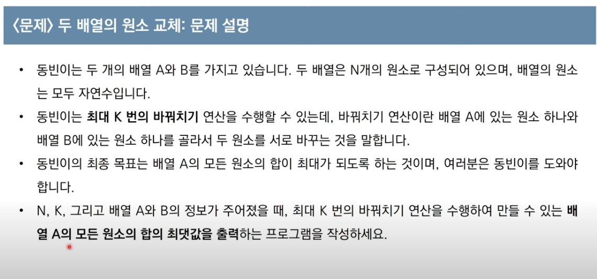

**범위 : 1<=N < 100,000, 0<= K <=N**


예를 들어 N=5, k=3, 배열 A와 B가 다음과 같다고 해보자.<br>
<br>
배열 A = [1, 2, 5, 4, 3] <br>
배열 B = [5, 5, 6, 6, 5]
<br>
이 경우, 다음과 같이 세 번의 연산을 수행할 수 있습니다.<br>
1) 배열 A의 원소 1과 배열 B의 원소 6을 바꾸기<br>
2) 배열 A의 원소 2와 배열 B의 원소 6을 바꾸기<br>
3) 배열 A의 원소 3과 배열 B의 원소 5를 바꾸기
<br>
세 번의 연산 이후 배열 A와 배열 B의 상태는 다음과 같이 구성될 것입니다.
- 배열 A = [6,6,5,4,5]
- 배열 B = [3,5,1,2,5]

이 때 배열 A의 모든 원소의 값이 합은 26이 되며, 이보다 더 합을 크게 만들 수 없습니다.

> 여기서 메인 아이디어는 ``배열 A를 오름차순``으로 정렬하고, <br> ``배열 B를 내림차순``으로 정렬해서 같은 인덱스끼리 k번만큼 바꾸면 배열 A의 합은 최대가 될 것입니다. 

```python
n, k = map(int, input().split())
a = list(map(int, input().split()))
b = list(map(int, input().split()))

a.sort() # 오름차순 정렬
b.sort(reverse = True) # 내림차순 정렬

for i in range(k):
    if a[i] < b[i] :
        a[i], b[i] = b[i], a[i]
        
    else : 
        break

print(sum(a)) # 배열 a의 합을 출력
```
파이썬의 자체 내장 기본 정렬 알고리즘을 따르기 때문에 <br>
시간 복잡도는 최악의 경우 $$O(NlogN)$$을 따르게 된다. 
